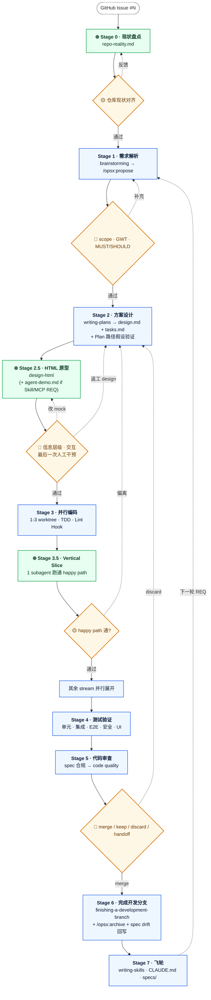

# TokenBoss 开发工作流

> 从「需求」到「归档 + 飞轮」的端到端方法。
> **v1.0 · 单仓简化版** — 跑 3-5 轮 REQ 后基于实战 retro 再增强。
>
> **图例：** 🟢 全自动 · 🟡 自动 + 人工核查 · 🔴 人工拦截（不可跳过）· ⊕ TokenBoss 增强环节
>
> **与 goldfin-docs 原版差异：** 单仓简化 — 砍 Stage 2.7（双仓翻译，不需要）+ 砍 Stage 4.5（Live Demo gate，Zeabur preview 未启用）。保留 Stage 0 / 2.5 / 3.5 三个 ⊕ 增强。

---

## 1. 流程总览



---

## 2. 角色分工速查表

| Stage | 主要 skill / 工具 | 自动产出 | 人工角色 |
|---|---|---|---|
| **⊕ 0 现状盘点** | bash + grep + git | `repo-reality.md` | 1-2 min 验"假设跟实际不符" |
| 1 需求解析 | `superpowers:brainstorming` → `/opsx:propose` | `proposal.md` + `specs/<cap>/spec.md` (GWT) | 验 scope / GWT / MUST/SHOULD |
| 2 方案设计 | `superpowers:writing-plans` | `design.md` + `tasks.md` | （随 2.5 一起核查） |
| **⊕ 2.5 HTML 原型** | `design-html` skill | `mock/index.html` (+ 可选 `agent-demo.md`) | **最后一次人工干预**：信息层级 / 交互 / 边界 |
| 3 并行编码 | `subagent-driven-development` + `test-driven-development` + Lint Hook | 1-3 worktree 并行实施 | （一般无） |
| **⊕ 3.5 Vertical Slice** | 1 个 subagent 先跑 happy path | 最小端到端可点版本 | 30 min 实操确认方向 |
| 4 测试验证 | `verification-before-completion` | 5 项绿 + 报告 | （一般无） |
| 5 代码审查 | `requesting-code-review` + `receiving-code-review` | 审查通过 PR + 安全报告 | 4 选项决策 |
| 6 完成分支 | `finishing-a-development-branch` + `/opsx:archive` | main 合并 · spec delta 合入 · 归档 | 最终验收 |
| 7 飞轮 | `writing-skills` | 新 skill + CLAUDE.md 更新 + specs/ 累积 | — |

---

## 3. Stage 0 · 现状盘点 ⊕

**输入：** 当前仓库状态（分支 / 部署目标 / 测试 infra / 未 merge 的 feature branch）
**输出：** `openspec/changes/gh-NN-<slug>/repo-reality.md`（5-10 min 产出 · 24h 内可 reuse）

> **为什么需要：** 没有这一步，spec/plan 阶段的所有路径假设、命名约定、约束都没人验证 — 直到 Stage 3 实施时才暴露。5-10 min 盘点换 Stage 3 几小时返工。

### 🟢 自动 — 8 个维度 reality 调查

| 维度 | 必查项 | 命令例 |
|---|---|---|
| **结构** | 三 stream 边界：`frontend/`（React + Vite · Zeabur）· `backend/`（Node + TypeScript · Zeabur）· `ClawRouter/`（独立 npm package，wallet auth + x402） | `ls`, `git ls-files \| head -50` |
| **分支** | 默认 `main` · 当前 HEAD · 相关 `feature/*` 未 merge | `git branch -a`, `git log origin/main --oneline \| head -20` |
| **数据层** | backend 当前用的存储（grep 实际 import：`@aws-sdk/client-dynamodb` / `better-sqlite3` / 其他）· 表/集合 schema · 是否需要新表 | `grep -rn "from '@aws-sdk\\|better-sqlite3'" backend/src` |
| **Test infra** | backend/frontend: vitest · ClawRouter: vitest + resilience suites · E2E: playwright (`.playwright-mcp/`) · `npm test` 各端能跑吗 | 实际跑一遍 |
| **Lint / type baseline** | `npm run typecheck` 现在过吗？每个 stream 单独跑 · baseline warning 多少？ | 三个 stream 各跑一次 |
| **OpenSpec 状态** | `openspec/changes/` 已有未 archive 的 REQ？跟本次冲突吗？ | `ls openspec/changes/` |
| **部署 / 环境变量** | Zeabur Variables（frontend + backend）· `.env.example` 跟 `.env` 是否齐 · 本期改动是否动到 env 变量 | `cat .env.example`, `gh secret list` |
| **本机 toolchain + 端口** | `node >= 20` · `npm` · 端口 3000/5173/其他被占？ | `which node`, `lsof -iTCP:3000 -sTCP:LISTEN` |

### 🟡 人工核查（1-2 min）

agent 写完 `repo-reality.md` 后，人工 1-2 min 过一遍：

1. **PM 描述对得上吗？** 你以为 backend 跑 SQLite，其实是 DynamoDB / 你以为 X 在 main 上但还在 feature/* 等
2. **跨分支依赖怎么处理？** 等 X 合 main / fork off X / cherry-pick X / 基于 main 起
3. **Lint baseline 怎么处理？** baseline 有 N 个预存 warning 时，Stage 3 dispatch 写"不引入 NEW warning"而不是"全 clean"
4. **三 stream 边界判断对吗？** REQ 真的只动 frontend 吗？是否涉及 backend API 改动 / ClawRouter 路由更新？

### 何时跳过

距上次 Stage 0 < 24h + 仓库无大改（main 没 merge 大件 / 没新表结构 / 测试 infra 没变 / 没新 feature branch 落地）→ 写 `proposal.md` 时引用 "Stage 0 reused from <date>"。**不要在没盘点的情况下假定。**

### `repo-reality.md` 推荐格式

```markdown
# Repo Reality Check · YYYY-MM-DD

## 结构
- monorepo: frontend/ + backend/ + ClawRouter/
- ClawRouter 是独立 npm package（@blockrun/clawrouter），有自己的 CLAUDE.md

## 分支
- 默认: main · 当前 HEAD: <sha>
- 相关未 merge feature: （列出）

## 数据层
- backend 当前用 <DynamoDB / better-sqlite3 / 其他>（grep 验证）
- 表/集合 schema: <列出>
- 本期需要新建表？是 / 否

## Test infra
- vitest: 三个 stream 各自 npm test 都能跑（验证过）
- E2E: playwright via .playwright-mcp/

## Lint / type baseline
- frontend typecheck: clean / N warnings
- backend typecheck: clean / N warnings
- ClawRouter: clean / N warnings

## 部署
- frontend + backend 都部署 Zeabur（`zbpack.json` + Dockerfile）
- `backend/template.yaml` 是历史 AWS SAM 配置，**当前不用**
- 本期改动是否影响 Zeabur 部署管道？env 变量有新增？

## 跨分支依赖
- （列出）

## 已知 quirk
- （列出 baseline 预存的 lint warning / 历史遗留）
```

---

## 4. Stage 1 · 需求解析

**输入：** `repo-reality.md` + GitHub Issue 描述（`gh issue view <N>`）+ 设计稿 + 历史 specs
**输出：** `proposal.md` + `specs/<cap>/spec.md`（GWT）+ 需求边界

### 🟢 自动 — Superpowers brainstorming（六步反问）

session 启动后，agent 检测到新任务**自动加载** brainstorming skill 进入反问流程，无需手动 `/brainstorm`：

- **Step 1-2** 问题定义 / 用户场景
- **Step 3-4** 范围边界 / 分阶段拆解
- **Step 5-6** 确认实施 / 范围总结

> ⚠️ **HARD-GATE：** 在你回 "yes" / 提供细节之前，agent 不会跳过这一步。

### 🟢 自动 — `/opsx:propose`

brainstorming 通过后，agent 调用 `/opsx:propose` 生成骨架：

| 文件 | 内容 |
|---|---|
| `proposal.md` | 背景 / 目标 / 范围 / 限制条件 |
| `specs/<cap>/spec.md` | Given / When / Then 场景 |
| `design.md` · `tasks.md` | 留空骨架，待 Stage 2 填充 |

RFC 2119 关键词（MUST / SHOULD / MAY）由 agent 自动统一格式。

### 🟡 用户视角分流（TokenBoss 特定）

TokenBoss 主要面向 **AI Agent 使用者**（OpenClaw / Hermes / Claude Code / Codex 用户）。Stage 1 brainstorming 必须明确这次 REQ 面向：

- **A. Human web UI** — frontend 上能看到的功能（dashboard / 充值 / 订阅）
- **B. Agent API/SDK** — agent 从自己的 IDE/CLI 里调用 TokenBoss 操作（Stage 2.5 需要 `agent-demo.md`）
- **C. Both** — 混合形态（两种 mock 都做）

分流影响 Stage 2.5 mock 形态 + Stage 4 测试侧重点。

### 🔴 人工核查

proposal.md 和 specs/ 生成后审查 4 件事：

1. scope 边界是否过宽
2. GWT 是否覆盖所有路径
3. MUST/SHOULD/MAY 强制级别是否准确
4. 用户视角分流（A/B/C）是否明确
5. 通过后 agent 才进 Stage 2

---

## 5. Stage 2 · 方案设计

**输入：** `proposal.md` + `specs/` + 现有代码
**输出：** `design.md` + `tasks.md` + 接口定义 + 数据模型

### 🟢 自动 — Superpowers writing-plans

agent 读 specs/ 后自动生成 design.md + tasks.md：

- 技术选型 + 架构图 + 认证策略 + 数据模型（DynamoDB 表设计 / API 契约）
- tasks.md 颗粒到文件级 / 代码级步骤
- **禁止 TBD / 占位符** — 任何未决项 inline 解决

### 🔴 门槛 — Plan 路径假设验证（写完 tasks.md 后立刻跑）

writing-plans 写完后**不要**直接进 Stage 2.5。5 min 把 plan 里所有 file/path/symbol 假设过一遍真实代码：

| 检查项 | 命令例 | 撞墙后果 |
|---|---|---|
| 每个 `Create: <path>` 父目录存在？路径风格跟兄弟文件一致？ | `ls $(dirname <path>)` | implementer 自创 dir 或选错位置 |
| 每个 `Modify: <path>:<line>` 文件存在？line 附近真有 plan 描述的代码？ | `sed -n '<line-3>,<line+10>p' <path>` | implementer 找不到改点 |
| Plan 里每个 fn / class / type ref 当前真存在？签名是 plan 假设的样子吗？ | `grep -nE "function <name>\|class <name>\|type <name>" frontend/src backend/src ClawRouter/src` | implementer 写出不能编译的代码 |
| Plan 里粘的代码片段编译片段层面 reasonable？ | 读一遍找 obvious mismatches | implementer 复制粘贴出编译错误 |
| Plan 里每个 route / API path / DynamoDB key / config key 跟现有约定一致？ | `grep -rn "<key>"` | implementer 凭假设写出找不到的 key |

发现问题 → **改 plan**（不是 implementer 阶段才改）。

> ⚠️ design.md 完成后**先不直接进 Stage 3**，进 Stage 2.5 用 HTML mock 校准。**最后一次人工干预放在 Stage 2.5**。

---

## 6. Stage 2.5 · HTML 原型 ⊕

**输入：** design.md + Stage 1 分流（A / B / C）
**输出：** `openspec/changes/gh-NN-<slug>/mock/index.html`（+ 可选 `mock/agent-demo.md`）

### 🟢 自动 — `design-html` skill（路径 A / C）

agent 读 design.md，生成可交互 HTML mock：

- Tailwind 风格，对齐 frontend 现有视觉系统（React 18 + Vite + Tailwind 3.4）
- 真实信息密度（基于 specs/ 的 GWT 场景填真数据，**禁 Lorem ipsum**）
- 边界状态全部画出（empty / error / loading / partial）
- 文件直接放进 change 文件夹的 `mock/` 子目录，archive 时随行

### 🟢 自动 — Agent demo 脚本（路径 B / C）

REQ 面向 Agent 用户时，**必须**额外补 `mock/agent-demo.md`：

```markdown
# Agent Demo · <REQ 名称>

## 调用场景
OpenClaw / Hermes / Claude Code / Codex 用户在自己的 agent 里这样调用 TokenBoss：

## 示例调用
\`\`\`bash
# 真实 CLI / SDK / MCP 调用 sample，含 prompt / 参数 / 期望响应
\`\`\`

## 预期 agent 体验
- 输入触发条件
- 中间状态（如果有）
- 成功 / 失败响应（含具体 schema）
- agent 能从响应里 reason 出什么下一步

## 失败路径
- 钱包余额不足 → ?
- 鉴权失败 → ?
- 超时 → ?
```

> **less is more** — 给 agent 看的响应要最小化但 reason-able，丰富功能交给 v2 Agent Skills 层。

### 🔴 人工核查（最后一次人工干预）

mock 跑起来后**实际过一遍**：

- **路径 A/C：** 信息层级 / 密度 / 主流程交互 / 边界状态覆盖
- **路径 B/C：** agent-demo.md 调用示例真实吗？响应能让 agent 继续推进吗？失败路径完整吗？
- 架构 / 接口 / 认证是否合理（从 design.md 沿用）

偏差 → 改 design.md 或改 mock，二者保持一致。**通过后进 Stage 3 全自动 1-4h**。

---

## 7. Stage 3 · 并行编码

**输入：** `openspec/changes/gh-NN-<slug>/{proposal,design,tasks}.md` + `specs/` + `mock/` + 顶层 `CLAUDE.md`
**输出：** 单 PR：代码（1-3 stream）+ `openspec/changes/gh-NN-<slug>/` 同 diff

### 🟢 自动 — Superpowers subagent-driven-development

Stage 2.5 通过后进**全自主执行模式（持续 1-4h）**：

- 按 `tasks.md` 顺序为每个 task 启动 subagent
- 每个 subagent 自动加载顶层 `CLAUDE.md` + 对应 stream 的子目录约定
- 测试基准是 `specs/<cap>/spec.md` 的 GWT
- subagent 内部自动执行 TDD + 进度回报

### 🟡 Worktree 策略 — 按需 1-3 个

不要默认起 3 个。看 `tasks.md` touched files 决定：

| 触及范围 | Worktree 数 |
|---|---|
| 只动 frontend | 1 |
| 只动 backend | 1 |
| 只动 ClawRouter | 1 |
| frontend + backend 不重叠 | 2 |
| 三端都动且不重叠 | 3 |
| 跨端 contract 改动（API schema / DynamoDB schema） | 1 个 worktree 顺序做（避免 schema race） |

| Stream | 范围 | 加载约定 |
|---|---|---|
| Frontend | `frontend/src/`, `frontend/public/` | 顶层 `CLAUDE.md`（frontend 章节）+ `frontend/tailwind.config.js` + `frontend/vite.config.ts` |
| Backend | `backend/src/`, `backend/scripts/` | 顶层 `CLAUDE.md`（backend 章节）+ `backend/Dockerfile` + `backend/zbpack.json`（Zeabur 部署） |
| ClawRouter | `ClawRouter/src/`, `ClawRouter/scripts/` | **`ClawRouter/CLAUDE.md`**（独立约定，不要被顶层覆盖）+ `ClawRouter/CONTRIBUTING.md` |

> 这是 agent 自主工作的最长时段（1-4h），**人可以去做别的事**。

### 🟢 Spec drift 反向通道

实施期间发现 `specs/` / `design.md` 描述跟现实不符，agent **不要直接改 spec**：

1. 把偏差 + 建议修改 + 当前实施怎么处理写到 `design.md` 的 "## Spec Drift" 章节
2. 继续按当前实施推进
3. Stage 5 review 时人工决定接受 / 拒绝；Stage 6 archive 时回写到 `openspec/specs/<cap>/spec.md`

这样**单一信息源**是 `openspec/changes/<req>/`，`design.md` 的 Spec Drift 是 audit trail。

### 🔴 Lint / Type / Format 门槛

PostToolUse hook 在 agent 每次写文件后自动触发（按 stream 分流）：

| Stream | 命令 |
|---|---|
| Frontend | `npm run typecheck` (frontend) + ESLint + Prettier |
| Backend | `npm run typecheck` (backend) + ESLint + Prettier |
| ClawRouter | `npm run lint` + `npm run format` + `npm run typecheck`（ClawRouter 自己定义） |

发现问题自动回单 agent 修改，确保代码规范实时生效。

---

## 8. Stage 3.5 · Vertical Slice ⊕

**输入：** Stage 3 启动了 N 个 worktree，但**先不要 N 个并行**
**输出：** 1 端跑通 happy path，验证方向后再放并行

### 🟡 规则 — 先 1 后 N

不让所有 subagent 同时跑 1-4h 再回头 review。**先让 1 个 subagent 跑通最小 happy path（不 robust 也行）**，30 min 内人工实际操作一遍：

- 流程能不能走通？
- 数据对得上 mock 预期？
- design.md 有没有遗漏？

### 🟢 通过后 — 其余 stream 并行展开

Stage 3 完整版按原计划跑（其余 stream subagent + TDD + Lint Hook 并行）。

### 🔴 不通过 — 回 Stage 2

发现方向偏差，**不要在 Stage 3 内修补**，回 Stage 2 重写 design.md（必要时改 Stage 2.5 mock）。

> 成本对比：1 worktree 1h 错 = 损失 1h；3 worktree 4h 错 = 损失 12h + 3 个分支 discard。Vertical slice 是**便宜的早失败**。

### 何时跳过

- 纯 chore / schema migration / refactor 类（无新交互流程）→ 可跳过
- UI / 新功能 / 跨 stream contract → **必跑**

---

## 9. Stage 4 · 测试验证

**输入：** 各 stream 代码 + 测试 + specs/ + mock
**输出：** 5 项绿 + 报告 + 可 commit 代码

| 1 单元测试 | 2 集成测试 | 3 E2E 测试 | 4 安全测试 | 5 UI 测试 |
|---|---|---|---|---|
| 各 stream vitest | vitest（DynamoDB local / API） | playwright | `npm audit` + secrets scan | playwright screenshot diff |

### 🟢 自动 — Superpowers verification-before-completion

agent 声称"完成"前，skill 自动启动，**必须实际跑命令并捕获输出**：

- 5 项验证全部启动 → agent 自主执行
- 任一失败 → 自动进入修复循环（不需要人工触发）

### Agent 视角测试（路径 B / C 必跑）

REQ 是 Agent API/SDK 类时，单元 / 集成 / E2E 之外还要跑一组 **agent contract test**：

- 用 `mock/agent-demo.md` 里的真实调用 sample 当 test fixture
- 验证响应 schema 跟 demo 写的一致
- 验证失败路径返回的错误对 agent 是 reason-able 的

---

## 10. Stage 5 · 代码审查

**输入：** PR（代码 + `openspec/changes/<req>/` 同 diff）
**输出：** 审查通过的 PR + 安全报告

### 🟢 自动 — Superpowers requesting-code-review（分级两阶段）

| 阶段 | 关注点 | 对照 ground truth |
|---|---|---|
| 第一阶段 | spec 合规（实现是否对应 `specs/<cap>/spec.md` 的 GWT） | `openspec/changes/<req>/specs/<cap>/spec.md` |
| 第二阶段 | code quality（可读性 / 复用 / 性能 / 跨 stream contract） | 顶层 `CLAUDE.md` + 各 stream 子约定 |

reviewer 在 PR 里**同时看代码 + spec**，不需要跨仓。

### 🟢 Review depth heuristic（按 task 体量分档）

| Task 体量 | Review 模式 | Subagent 数 |
|---|---|---|
| **Trivial**（≤ 30 行 diff、单文件、无新逻辑） | Inline by controller | 0 |
| **Small**（30-100 行、1-2 文件、机械实现） | Single combined review | 1 |
| **Medium / Large**（> 100 行、多文件、含业务逻辑或 tests） | Two-stage（spec → code quality） | 2 |
| **Test-heavy**（> 200 行测试，业务覆盖矩阵复杂） | Two-stage + test reviewer 第三轮 | 3 |

**升档触发：** implementer 报 DONE_WITH_CONCERNS 或做了 plan 没明确许可的 adaptation → 升一档。

### 🔴 人工拦截 · 4 选项

| 选项 | 含义 |
|---|---|
| **merge** | spec drift 可接受 → merge to main |
| **keep** | 保留 PR 不 merge（继续迭代） |
| **discard** | 关 PR，弃用本次实施 |
| **handoff** | 关 PR + 移交（spec 保留作参考） |

### 🟢 自动 — Superpowers receiving-code-review

接收反馈后自动分析问题并进入修复循环：

- 解析 review comments 并分类（spec 偏离 / 代码质量 / 安全）
- 自动修复并重新启动 verification
- 修复完成后向反馈者确认复查

---

## 11. Stage 6 · 完成开发分支

**输入：** 审查通过的 PR + `openspec/changes/gh-NN-<slug>/`
**输出：** main 合并 + archive + spec drift 回写 + worktree 清理 + GitHub Issue 关闭（带 audit comment）

### 🟢 自动 — Superpowers finishing-a-development-branch

PR 合并到 main 后**自动触发**：

1. **Spec drift 回写：** `design.md` 的 ## Spec Drift 章节内容回流到 `openspec/specs/<cap>/spec.md`（**长期累积**）
2. **Archive：** `openspec/changes/gh-NN-<slug>/` → `openspec/changes/archive/YYYY-MM-DD-gh-NN-<slug>/`
3. **`/opsx:archive`** 同步 delta spec 到 capability spec
4. **清理：** worktree + `feature/<slug>` branch refs 删除
5. **GitHub Issue 关闭：** PR description 含 `Closes #N`（merge 后 GitHub 自动关闭）；merge 后 `gh issue comment <N> --body "Implemented in <PR-url>. Spec archived at openspec/changes/archive/<...>"` 留 audit trail

### 🟡 人工

确认 archive 干净 + drift 全部回写 + GitHub Issue 已关闭 + comment 留下了 spec 位置。做最终验收。

---

## 12. Stage 7 · 自我迭代飞轮

**输入：** CI 日志 + review 记录 + hook 阻断记录
**输出：** 新 skill + 更新 `CLAUDE.md` + 更新 `openspec/specs/<cap>/spec.md`

### 🟢 自动 — Superpowers writing-skills

根据本轮开发的错误和最佳实践，提炼为可重用 skill：

- 收集 CI 失败日志 / review 提示 / hook 阻断
- 提取重复出现的代码模式 → 沉淀新 SKILL
- 生成 SKILL.md 并关联到顶层 CLAUDE.md
- `openspec/specs/<cap>/spec.md` 同步更新

> 飞轮的价值：**每一轮 REQ 结束都让下一轮更自动化**。Stage 1 在下一个 REQ 启动时会自动加载这些新 skill。

---

## 13. 关键设计原则

1. **单一信息源：** `openspec/changes/gh-NN-<slug>/` 是 per-REQ 草稿源 + deliverable（单仓 PR 直接看 spec + 代码 diff，不分裂）
2. **三道 HARD-GATE：** Stage 1 反问、Stage 2.5 mock 终审、Stage 5 merge 决策 — 不可绕过
3. **change 一次性，spec 累积：** `openspec/changes/<req>/` 是 per-REQ 干净交付，archive 后冻结；`openspec/specs/<cap>/spec.md` 跨 REQ 持续累积 = 长期产品文档 + 后续自动测试输入
4. **subagent + worktree 隔离：** Stage 3 并行 agent 在独立 worktree 跑，互不污染
5. **早失败便宜：** 3 个 ⊕ 增强（0 / 2.5 / 3.5）让错误尽量在便宜阶段发现 — Stage 0 抓"假设错"、Stage 2.5 抓"信息层级 + Agent 调用路径错"、Stage 3.5 抓"方向错"
6. **AI Agent 用户视角：** Stage 1 分流（Human web UI vs Agent API/SDK）决定 Stage 2.5 mock 形态 + Stage 4 测试侧重；给 agent 看的响应 less is more，丰富功能交给 v2 Skills 层
7. **HTML 优先于 Pencil：** Web UI REQ 走 HTML mock；Pencil 仅留给纯品牌探索
8. **iterate-don't-rebuild：** 改造现有组件 / 共享组件先改源再批量应用，不另起炉灶（见 memory `feedback_iterate_existing_code.md`）
9. **飞轮：** Stage 7 让经验沉淀为 skill，下一轮自动加载

---

## 14. 仓库映射

### TokenBoss monorepo（单仓简化版）

| 工作流概念 | 仓库位置 |
|---|---|
| change 文件夹（**源 of truth**） | `openspec/changes/gh-NN-<slug>/` |
| change 内 4 件套 | `proposal.md` · `design.md` · `tasks.md` · `specs/<cap>/spec.md` |
| **⊕ Stage 0 现状盘点** | `openspec/changes/gh-NN-<slug>/repo-reality.md` |
| **⊕ HTML 原型** | `openspec/changes/gh-NN-<slug>/mock/index.html` |
| **⊕ Agent demo（路径 B/C）** | `openspec/changes/gh-NN-<slug>/mock/agent-demo.md` |
| change 内附加产物 | `discoveries.md` · 任意辅助文件（archive 时随行） |
| capability spec（**长期跨 REQ 累积**） | `openspec/specs/<capability>/spec.md` |
| 已 ship 归档 | `openspec/changes/archive/YYYY-MM-DD-gh-NN-<slug>/` |
| 项目级 AI 约定 | 顶层 `CLAUDE.md`（含 frontend / backend / ClawRouter 章节） |
| Stream 代码 | `frontend/` · `backend/` · `ClawRouter/`（后者有独立 `CLAUDE.md`） |
| 历史 spec/plan（pre-2026-05-13） | `docs/legacy/superpowers/{design,plans,specs}/`（只读归档） |

### 命名约定

| 项 | 规则 |
|---|---|
| `<slug>` | `gh-<issue-number>-<kebab-case>`（如 `gh-42-credits-economy`），跟 GitHub Issue number 1:1 对应 |
| `<capability>` | 单数英文名（如 `credits`, `subscription`, `auth`, `router`） |
| Archive 命名 | `archive/YYYY-MM-DD-<原 slug>/` |
| 历史 changes（无 gh 前缀） | `add-seo-baseline`, `pause-membership-tiers` 这两个保留原状不强制改名；新 change 必须带 `gh-<NN>-` 前缀 |

### 任务源链接

| 系统 | 位置 / 用法 |
|---|---|
| 任务源 | **GitHub Issues**（本仓） |
| Issue → spec 反向链 | merge 后 `gh issue comment <N> --body "Implemented in <PR-url>. Spec at openspec/changes/archive/<...>"` |
| spec → Issue 正向链 | `proposal.md` front matter 写 `issues: [#42]`；PR description 写 `Closes #42`（merge 时自动关闭 issue） |
| 查看 issue | `gh issue list`（看在飞）/ `gh issue view <N>`（看单条）/ `gh issue create`（新建） |
| 新建 issue 模板 | 暂未建 `.github/ISSUE_TEMPLATE/`；建一个的话推荐 Feature / Bug / Chore 三种，每种含「面向 human UI / agent API/SDK / both」选项以衔接 Stage 1 分流 |

### 部署

| Stream | 部署路径 |
|---|---|
| Frontend | Zeabur (`frontend/zbpack.json` + Dockerfile + nginx) |
| Backend | Zeabur (`backend/zbpack.json` + Dockerfile) |
| ClawRouter | npm publish（独立 package `@blockrun/clawrouter`） |
| Stage 4.5 Live Demo gate | **本期未启用**；后期 Zeabur preview 开通后再补 |

> `backend/template.yaml` + `npm run deploy` (sam build) 是历史 AWS SAM 配置，**当前未启用**。grep 现实代码用什么数据层（DynamoDB SDK vs better-sqlite3）以 backend/src/ 实际 import 为准。

---

## 15. 何时跳过 / 简化

| 场景 | 简化 |
|---|---|
| chore / docs 改进（无代码） | 跳过 Stage 0 / 2.5 / 3 / 3.5 / 4，直接 Stage 1 → 5 |
| Hot-fix（线上 bug 救火） | Stage 0 简化为"问题复现 + root cause"；Stage 2 design 一段话；Stage 4 只跑相关测试 |
| 24h 内重复跑 Stage 0 | reuse 上次 `repo-reality.md`，proposal.md 标注 "Stage 0 reused from <date>" |
| 单 stream REQ | Stage 3 起 1 worktree；Stage 3.5 仍跑（验方向便宜） |
| Schema migration / refactor 类 | Stage 3.5 可跳过；其余 stage 不变 |

---

## 16. v2 演进区（pending · 跑 3-5 轮 REQ 后填）

每次 retro 累积的"下次工作流要改的"放这里。v2 重写时所有条目消化进正文 + 删本节。

### 候选改进

- Zeabur preview branch 开通后接回 Stage 4.5 Live Demo gate
- 跨 REQ 共享 mock 资产（如 design system snapshot）
- GitHub Issue 模板沉淀（`.github/ISSUE_TEMPLATE/` 三种类型，把 Stage 1 用户视角分流前置到 issue 创建时）
- Agent demo 形式的自动化测试（用 demo.md 当 fixture 直接跑）
- ClawRouter 独立发布流程跟主 monorepo PR 的协调（目前未明确）
