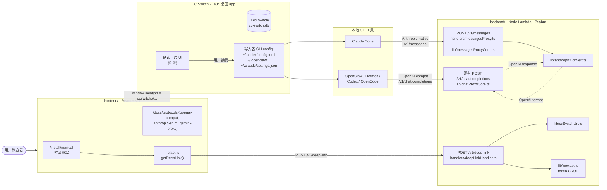

# Design · gh-3-tokenboss-cc-switch-integration

> Stage 2 writing-plans 输出。Stage 1 brainstorming 已 commit on [[proposal.md]] 的 6 项关键决策（D1-D6），本文档补 **D7-D8**（Stage 2 reality check 发现的新决策）+ 完整接口 schema + 数据流 + 组件职责。

---

## 1. 架构总览



**关键不变量：**
- TokenBoss 上游 API 唯一根域 = `https://api.tokenboss.co/v1`
- 所有 CLI 都用同一个 reserved "CC Switch" newapi token
- CC Switch 收到 5 个独立 deep link → 弹 5 张独立确认卡片
- 协议转换发生在 backend `lib/anthropicConvert.ts`，不在 frontend 也不在 chatProxy 内部

---

## 2. 组件职责矩阵

| 文件 / 模块 | 职责 | 依赖 | 输出 |
|---|---|---|---|
| `backend/src/lib/anthropicConvert.ts` | Anthropic ↔ OpenAI 双向格式转换（含 SSE streaming） | 纯函数，无 IO | request/response 转换 + SSE event sequence |
| `backend/src/lib/ccSwitchUrl.ts` | 按 CC Switch deep link v1 schema 生成 5 个 app 的 URL | 纯函数 | `ccswitch://v1/import?...` 字符串 |
| `backend/src/handlers/deepLinkHandler.ts` | `POST /v1/deep-link` endpoint：拉 newapi token + 调用 ccSwitchUrl | newapi.ts, ccSwitchUrl.ts, requireSession | `{ key_name, deep_links: [...] }` JSON |
| `backend/src/lib/messagesProxyCore.ts` | Streaming `messages` 核心：接收 Anthropic-format → 转 OpenAI → dispatch chatProxyCore → 转回 Anthropic | anthropicConvert.ts, chatProxyCore.ts | SSE stream / non-stream JSON |
| `backend/src/handlers/messagesProxy.ts` | Lambda streamifyResponse wrapper（mirrors chatProxy.ts pattern） | messagesProxyCore.ts | Lambda streaming response |
| `frontend/src/lib/agentDefs.ts` | 5 个 CLI app 的 metadata：id / displayName / icon / homepage / protocol-family | 静态数据 | 常量 export |
| `frontend/src/lib/api.ts` (扩展) | `getDeepLink()`: 调 `POST /v1/deep-link` | 现有 request core | Promise<DeepLinkResponse> |
| `frontend/src/components/PrimaryImportButton.tsx` | 主按钮：拉 deep link → 依次触发 `window.location` | api.ts, agentDefs.ts | React 组件 |
| `frontend/src/components/ImportScopeNote.tsx` | 主按钮下方文案"本次会弹 N 张卡片" | agentDefs.ts | 静态组件 |
| `frontend/src/components/KeyInjectionFlow.tsx` | 登录态 vs 未登录态分流容器 | auth.tsx context | 子树切换 |
| `frontend/src/components/LoggedInKeyPicker.tsx` | 登录态：直接调用 PrimaryImportButton | api.ts | 登录态子树 |
| `frontend/src/components/AnonKeyPasteInput.tsx` | 未登录态：输入框 + 校验 + client-side 构造 deep link | ccSwitchUrl client-side mirror | 未登录态子树 |
| `frontend/src/components/CCSwitchDetector.tsx` | 永远显示的"未装 CC Switch?" 引导卡 | 纯静态 | 提示卡片 |
| `frontend/src/components/ProtocolFamilyLinks.tsx` | 3 个外链卡片到 /docs/protocols/* | 纯静态 | 3 个 link card |
| `frontend/src/components/AdvancedManualRecipes.tsx` | 折叠包旧 RECIPES 数组（4 个 Agent recipe） | 旧 RECIPES 数据 | disclosure 内容 |
| `frontend/src/screens/ManualConfigPC.tsx` (重写) | 主屏，组合上述所有新组件 + 保留旧 RECIPES 数据 | 上述全部 | /install/manual 屏 |
| `frontend/src/screens/docs/ProtocolOpenAICompat.tsx` | OpenAI-compat 协议详解屏 | 现有共享组件 | /docs/protocols/openai-compat 屏 |
| `frontend/src/screens/docs/ProtocolAnthropicShim.tsx` | Claude 协议接入屏 | 现有共享组件 | /docs/protocols/anthropic-shim 屏 |
| `frontend/src/screens/docs/ProtocolGeminiProxy.tsx` | Gemini 协议接入屏 | 现有共享组件 | /docs/protocols/gemini-proxy 屏 |

---

## 3. Backend API 契约

### 3.1 `POST /v1/deep-link`

**Path:** `/v1/deep-link`（**修正** — proposal.md 原写 `/api/me/deep-link`，但跟现有所有 endpoint `/v1/*` pattern 不一致，统一为 `/v1/deep-link`）

**Auth:** `Authorization: Bearer <jwt>`（沿用现有 `requireSession` / `verifySessionHeader`）

**Request body:** （empty — 一律返回 5 个 app 的 deep link）

**Response 200:**

```typescript
interface DeepLinkResponse {
  user_id: string;            // 来自 session
  key_name: "CC Switch";      // reserved name 常量
  key_id: number;             // newapi token id（用户可在 dashboard 删）
  deep_links: Array<{
    app: "openclaw" | "hermes" | "codex" | "opencode" | "claude";
    display_name: string;     // "OpenClaw" / "Hermes Agent" / "Codex CLI" / "OpenCode" / "Claude Code"
    url: string;              // ccswitch://v1/import?...
  }>;
  issued_at: string;          // ISO 8601 UTC
}
```

**Response error shapes（沿用现有 `jsonError` pattern）:**

```typescript
// 401 未登录
{ error: { type: "authentication_error", message: "...", code: "missing_session" | "invalid_session" } }

// 503 newapi 未配置
{ error: { type: "service_unavailable", message: "...", code: "newapi_not_configured" } }

// 409 用户未绑定 newapi
{ error: { type: "conflict", message: "...", code: "newapi_not_linked" } }

// 502 newapi 上游错误
{ error: { type: "upstream_error", message: "..." } }

// 503 newapi 限流
{ error: { type: "service_unavailable", message: "上游短暂限流，请等几十秒再重试。", code: "newapi_rate_limited" } }
```

### 3.2 `POST /v1/messages` (Anthropic-compat shim)

**Path:** `/v1/messages`

**Auth:** `x-api-key: sk-...`（Anthropic SDK 默认）**或** `Authorization: Bearer sk-...`（兼容 OpenAI SDK 用户）

> Implementation note: `messagesProxyCore` 接到任一 header 都 normalize 成 `Authorization: Bearer sk-...` 再 dispatch 给 chatProxyCore（chatProxyCore 只认 Bearer header）。

**Request body (Anthropic-native):**

```typescript
interface AnthropicMessagesRequest {
  model: string;                    // e.g. "claude-sonnet-4-5"
  messages: Array<{
    role: "user" | "assistant";
    content: string | Array<{ type: "text"; text: string } | { type: "tool_use"; ... } | { type: "tool_result"; ... }>;
  }>;
  system?: string | Array<{ type: "text"; text: string }>;
  max_tokens: number;
  temperature?: number;
  top_p?: number;
  top_k?: number;
  stop_sequences?: string[];
  stream?: boolean;
  tools?: Array<{ name: string; description: string; input_schema: object }>;
  tool_choice?: { type: "auto" | "any" | "tool"; name?: string };
  metadata?: { user_id?: string };
}
```

**Response (non-stream, 200):**

```typescript
interface AnthropicMessagesResponse {
  id: string;                       // 透传 chatProxy 的 completion id 或重新生成 "msg_..."
  type: "message";
  role: "assistant";
  content: Array<
    | { type: "text"; text: string }
    | { type: "tool_use"; id: string; name: string; input: object }
  >;
  model: string;
  stop_reason: "end_turn" | "max_tokens" | "stop_sequence" | "tool_use";
  stop_sequence?: string;
  usage: { input_tokens: number; output_tokens: number };
}
```

**Response (stream, 200):**

`Content-Type: text/event-stream`，按 Anthropic SSE schema：

```
event: message_start
data: {"type":"message_start","message":{"id":"msg_...","type":"message","role":"assistant","content":[],"model":"...","stop_reason":null,"stop_sequence":null,"usage":{"input_tokens":N,"output_tokens":0}}}

event: content_block_start
data: {"type":"content_block_start","index":0,"content_block":{"type":"text","text":""}}

event: content_block_delta
data: {"type":"content_block_delta","index":0,"delta":{"type":"text_delta","text":"Hello"}}

(more content_block_delta...)

event: content_block_stop
data: {"type":"content_block_stop","index":0}

event: message_delta
data: {"type":"message_delta","delta":{"stop_reason":"end_turn","stop_sequence":null},"usage":{"output_tokens":N}}

event: message_stop
data: {"type":"message_stop"}
```

**Response errors** 都转 Anthropic format：

```typescript
{
  type: "error",
  error: {
    type: "invalid_request_error" | "authentication_error" | "permission_error" | "not_found_error" | "rate_limit_error" | "api_error" | "overloaded_error",
    message: string
  }
}
```

HTTP status code 透传（401 / 429 / 5xx）。

---

## 4. `anthropicConvert.ts` 函数签名 + Mapping Table

```typescript
// backend/src/lib/anthropicConvert.ts

import type { AnthropicMessagesRequest, AnthropicMessagesResponse } from "./anthropicTypes.js";
import type { OpenAIChatRequest, OpenAIChatResponse, OpenAIChatChunk } from "./openaiTypes.js";

export function requestToOpenAI(req: AnthropicMessagesRequest): OpenAIChatRequest;

export function responseToAnthropic(res: OpenAIChatResponse, originalModel: string): AnthropicMessagesResponse;

export function errorToAnthropic(err: { type: string; message: string; status: number }): {
  body: { type: "error"; error: { type: string; message: string } };
  status: number;
};

/**
 * Streaming SSE conversion.
 * Consumes async iterator of OpenAI chunks, yields Anthropic SSE events
 * (`{ event: string; data: object }`).
 */
export async function* streamToAnthropic(
  openAIChunks: AsyncIterable<OpenAIChatChunk>,
  meta: { messageId: string; model: string; inputTokens: number },
): AsyncGenerator<{ event: string; data: object }>;
```

**Field mapping table:**

| Anthropic | OpenAI | 备注 |
|---|---|---|
| `messages[].role: "user" \| "assistant"` | `messages[].role: "user" \| "assistant"` | 直传 |
| `messages[].content: string` | `messages[].content: string` | 直传 |
| `messages[].content: [{type:"text",text}]` | `messages[].content: string`（拼接）或 `[{type:"text",text}]` | OpenAI 也支持 multi-modal content array |
| `system: string` | 注入 `messages[0] = {role:"system", content:string}` | 顶层 → role:system message |
| `system: [{type:"text",text}]` | 同上，拼接 text | |
| `max_tokens: N` | `max_tokens: N` | 直传 |
| `temperature` / `top_p` | `temperature` / `top_p` | 直传 |
| `top_k` | （OpenAI 无对应，丢弃） | log warning |
| `stop_sequences` | `stop` | 直传 array |
| `stream: true` | `stream: true` | 直传 |
| `tools[].input_schema` | `tools[].function.parameters` | wrap into `{type:"function",function:{name,description,parameters}}` |
| `tool_choice.type:"auto"` | `tool_choice:"auto"` | |
| `tool_choice.type:"any"` | `tool_choice:"required"` | |
| `tool_choice.type:"tool",name` | `tool_choice:{type:"function",function:{name}}` | |
| `messages[].content: [{type:"tool_use",id,name,input}]` | `messages[].role:"assistant",tool_calls:[{id,type:"function",function:{name,arguments:JSON.stringify(input)}}]` | input → arguments JSON string |
| `messages[].content: [{type:"tool_result",tool_use_id,content}]` | `messages[].role:"tool",tool_call_id,content` | |

**Response mapping:**

| OpenAI | Anthropic | 备注 |
|---|---|---|
| `choices[0].message.content: string` | `content: [{type:"text",text:string}]` | 包成 array |
| `choices[0].message.tool_calls: [...]` | `content: [...{type:"tool_use",id,name,input:JSON.parse(arguments)}]` | 多个 tool_calls 各成一个 content block |
| `choices[0].finish_reason: "stop"` | `stop_reason: "end_turn"` | |
| `choices[0].finish_reason: "length"` | `stop_reason: "max_tokens"` | |
| `choices[0].finish_reason: "tool_calls"` | `stop_reason: "tool_use"` | |
| `usage.prompt_tokens` | `usage.input_tokens` | |
| `usage.completion_tokens` | `usage.output_tokens` | |

**SSE event mapping（关键 — streaming 转换器）:**

每个 OpenAI chunk `data: {"choices":[{"delta":{"content":"..."}}]}` → 多步 Anthropic event：

1. 第一个 chunk 收到时 emit `message_start` + `content_block_start`（type:"text"）
2. 每个 `delta.content` 非空 → emit `content_block_delta` (text_delta)
3. `tool_calls` chunk → emit `content_block_stop` 关 text → `content_block_start` 开 tool_use → 累积 args → `content_block_stop`
4. `finish_reason` 非 null → emit `content_block_stop` → `message_delta` (含 stop_reason) → `message_stop`

---

## 5. `ccSwitchUrl.ts` 函数签名 + 5 App Templates

```typescript
// backend/src/lib/ccSwitchUrl.ts

export type CCSwitchApp = "openclaw" | "hermes" | "codex" | "opencode" | "claude";

export interface CCSwitchAppMeta {
  app: CCSwitchApp;
  displayName: string;
  // 简化版（resource=provider，5 字段）适用 / 完整版（configFormat=json）适用
  schema: "simple" | "full";
}

export const CC_SWITCH_APPS: CCSwitchAppMeta[] = [
  { app: "openclaw", displayName: "OpenClaw", schema: "simple" },
  { app: "hermes", displayName: "Hermes Agent", schema: "simple" },
  { app: "codex", displayName: "Codex CLI", schema: "full" },   // Codex 需要 TOML config
  { app: "opencode", displayName: "OpenCode", schema: "simple" },
  { app: "claude", displayName: "Claude Code", schema: "full" }, // Claude 需要 env JSON
];

export interface CCSwitchUrlParams {
  app: CCSwitchApp;
  name: string;                    // 始终 "TokenBoss"
  endpoint: string;                // "https://api.tokenboss.co/v1"
  homepage: string;                // "https://www.tokenboss.co"
  apiKey: string;                  // sk-...
}

/** Generate the ccswitch:// URL for one CLI app. */
export function buildCCSwitchUrl(params: CCSwitchUrlParams): string;
```

**5 个 app 的 URL 模板：**

```
# openclaw / hermes / opencode (simple schema):
ccswitch://v1/import?resource=provider
  &app=<app>
  &name=TokenBoss
  &endpoint=<URL-encoded base_url>
  &homepage=<URL-encoded homepage>
  &apiKey=<URL-encoded sk-key>

# codex (full schema, config 包 TOML in JSON):
ccswitch://v1/import?resource=provider
  &app=codex
  &name=TokenBoss
  &configFormat=json
  &config=<base64(JSON({
    auth: { OPENAI_API_KEY: "<apiKey>" },
    config: "[model_providers.tokenboss]\nbase_url = \"<endpoint>\"\n\n[general]\nmodel = \"claude-sonnet-4-5\""
  }))>

# claude (full schema, env JSON):
ccswitch://v1/import?resource=provider
  &app=claude
  &name=TokenBoss
  &configFormat=json
  &config=<base64(JSON({
    env: {
      ANTHROPIC_AUTH_TOKEN: "<apiKey>",
      ANTHROPIC_BASE_URL: "<endpoint without /v1>",     // 见 D8 注释
      ANTHROPIC_MODEL: "claude-sonnet-4-5",
      ANTHROPIC_DEFAULT_HAIKU_MODEL: "claude-haiku-4-5",
      ANTHROPIC_DEFAULT_SONNET_MODEL: "claude-sonnet-4-5",
      ANTHROPIC_DEFAULT_OPUS_MODEL: "claude-opus-4"
    }
  }))>
```

> **D8 关键决策**：`claude` app 的 `ANTHROPIC_BASE_URL` 设为 `https://api.tokenboss.co`（**不带 /v1**），因为 Claude Code 客户端自动拼 `/v1/messages`。如果带 `/v1` 会变成 `/v1/v1/messages` 404。Stage 3.5 Vertical Slice **必须验证**这个假设（实际跑 Claude Code 一次确认 base url 拼接行为）。

---

## 6. Reserved "CC Switch" Key 管理流程

### 6.1 D7 关键决策：**删旧建新**（不是 reuse）

**Reality check 发现的约束**：newapi 的 listUserTokens 返回 **masked key**（plaintext 仅 createUserToken 时返回一次）。因此 backend 无法"复用同一个 key" — plaintext 拿不到。

**3 个候选方案：**

| 方案 | 描述 | 优 | 劣 |
|---|---|---|---|
| A | 每次点按钮创建新 key（不复用） | 实现最简单 | 用户 key 列表无限膨胀 |
| B | Backend 自己持久化 plaintext key（按 userId 索引）| Reuse 同一 key | 需要新 DB schema，且 plaintext 持久化是安全敏感（key leak 风险）|
| **C** | **删旧建新**：查找 name="CC Switch"，存在则删除，创建新的 | Key 列表始终只 1 个，无 plaintext 持久化 | 用户每次"一键导入"后旧 key 失效（CLI 跑老 key 会 401 — 但用户的预期就是"用最新配置"）|

**选 C** — 跟"一键导入"的语义匹配（"我现在要重新配置"），且 newapi.listUserTokens + deleteUserToken 都已存在。

### 6.2 流程序列

```
POST /v1/deep-link (Authorization: Bearer <jwt>)
   │
   ├─ requireSession → AuthContext
   │
   ├─ requireNewapiLink → newapi 已配置且 user.newapiPassword 存在
   │
   ├─ newapi.loginUser({ username: newapiUsername(userId), password: user.newapiPassword })
   │     → newapi session
   │
   ├─ newapi.listUserTokens(session)
   │     → tokens[]
   │
   ├─ existing = tokens.find(t => t.name === "CC Switch")
   │
   ├─ if (existing) newapi.deleteUserToken(session, existing.id)
   │
   ├─ created = newapi.createUserToken(session, { name: "CC Switch", remain_quota: -1, expired_time: -1, ... })
   │     → { id, key }   // key = plaintext sk-xxx
   │
   ├─ 5.times: url = buildCCSwitchUrl({ app, name: "TokenBoss", endpoint: "https://api.tokenboss.co/v1", homepage: "https://www.tokenboss.co", apiKey: created.key })
   │
   └─ return { user_id, key_name: "CC Switch", key_id: created.id, deep_links: [...], issued_at }
```

**Note:** 我没在 reality check 阶段确认 `newapi.createUserToken` 函数存在 — 看到 `listUserTokens` 和 `deleteUserToken` 存在，但 `createUserToken` 没 grep 出来。Stage 2 plan 路径假设验证时确认；若不存在，Task 3 第一步是先在 newapi.ts 加 createUserToken（不大）。

---

## 7. Frontend 组件 State Machines

### 7.1 `<KeyInjectionFlow>` 登录态分流

```
                    isLoggedIn? (来自 auth context)
                    /                              \
                  yes                              no
                  /                                 \
          <LoggedInKeyPicker>                <AnonKeyPasteInput>
                  │                                 │
                  ▼                                 ▼
          直接渲染 <PrimaryImportButton>      State:
                                              ├─ keyInput: string
                                              ├─ keyValid: boolean (regex /^sk-[A-Za-z0-9]{48}$/)
                                              └─ onClick: 
                                                  if !keyValid → show inline error
                                                  else → client-side buildCCSwitchUrl × 5 + window.location 序列
```

### 7.2 `<PrimaryImportButton>` 状态机

```
                           Idle
                            │
                  user clicks
                            │
                            ▼
                       Fetching ─── error ──▶ Idle (show toast)
                            │
                       fetch success (5 URLs)
                            │
                            ▼
                      Triggering (依次触发 5 个 url，200ms 间隔)
                            │
                       last url triggered
                            │
                            ▼
                       Toast "已发送到 CC Switch" → 3s 后 Idle
```

伪代码：

```typescript
async function handleClick() {
  setState("fetching");
  try {
    const { deep_links } = await getDeepLink();
    setState("triggering");
    for (const { url } of deep_links) {
      window.location.assign(url);
      await sleep(200);
    }
    showToast(`${deep_links.length} 张确认卡片已发送到 CC Switch`);
    setState("idle");
  } catch (err) {
    showErrorToast(err.message);
    setState("idle");
  }
}
```

> 注：`window.location.assign(ccswitch://...)` 在主流浏览器（Safari / Chrome / Firefox）行为是"调 URL scheme handler 但当前页面不导航"。等同 `<a href="ccswitch://">` click，浏览器不会真的离开当前页。Stage 3.5 实操验证。

---

## 8. Error Response Shapes 总览

| Endpoint | HTTP | type | code | 用户面 UX |
|---|---|---|---|---|
| `POST /v1/deep-link` | 401 | `authentication_error` | `missing_session` / `invalid_session` | Frontend 切到"贴 key 兜底"路径 |
| `POST /v1/deep-link` | 503 | `service_unavailable` | `newapi_not_configured` | "服务暂时不可用"，引导到 disclosure tab |
| `POST /v1/deep-link` | 409 | `conflict` | `newapi_not_linked` | "账号未链接到 newapi，请联系支持" |
| `POST /v1/deep-link` | 502 | `upstream_error` | — | "上游错误，请重试" |
| `POST /v1/deep-link` | 503 | `service_unavailable` | `newapi_rate_limited` | "请等几十秒再重试" |
| `POST /v1/messages` | 401 | Anthropic `authentication_error` | — | Claude Code 客户端处理 |
| `POST /v1/messages` | 429 | Anthropic `rate_limit_error` | — | 同 |
| `POST /v1/messages` | 5xx | Anthropic `api_error` / `overloaded_error` | — | 同 |
| `POST /v1/messages` | 400 (转换层错) | Anthropic `invalid_request_error` | — | message 含转换层具体问题 |

---

## 9. 关键决策追加（D7-D8）

| # | 决策 | 理由 |
|---|---|---|
| D7 | Reserved "CC Switch" key **删旧建新**（每用户 newapi 端始终最多 1 个 name="CC Switch" token） | newapi listUserTokens 返回 masked key，无法 reuse plaintext；avoid plaintext 持久化的安全风险；用户每次"一键导入"语义就是"重置配置"，旧 key 失效合理 |
| D8 | `claude` app 的 `ANTHROPIC_BASE_URL` 设为 `https://api.tokenboss.co`（**不带 /v1**） | Claude Code 客户端自动拼 `/v1/messages`；带 `/v1` 会变成 `/v1/v1/messages` 404；Stage 3.5 Vertical Slice 验证 |

合并 D1-D6（[[proposal.md]]）后总共 **8 项决策**。

---

## 10. Spec Drift

> Stage 3 实施期间发现 spec / design 跟现实偏离时记录在这里。Stage 6 archive 时反向回写到 [[proposal.md]] 和 [[specs/cc-switch-integration/spec.md]]。

（空）
